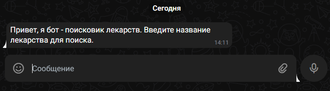
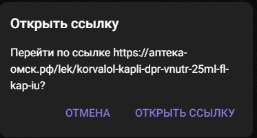

# Здесь находится 2 лаба
# Вариант 9
Чат-бот поиска лекарств в аптеках города (название лекарства) (+парсинг)

В файле Parser.py находится парсер, который сохраняет в текстовый файл данные о лекарствах
Файл main.py содержит 
При запуске бота он выводит следующий текст

При вводе названия лекарства бот выводит информацию о первом найденном лекарстве и инлайн кнопки для навигации

При нажатии на кнопку "Подробнее" пользователь переходит на страницу лекарства в онлайн аптеке

При нажатии кнопки "В меню" бот удаляет сообщение с кнопками и предлегает заново ввести лекрство

