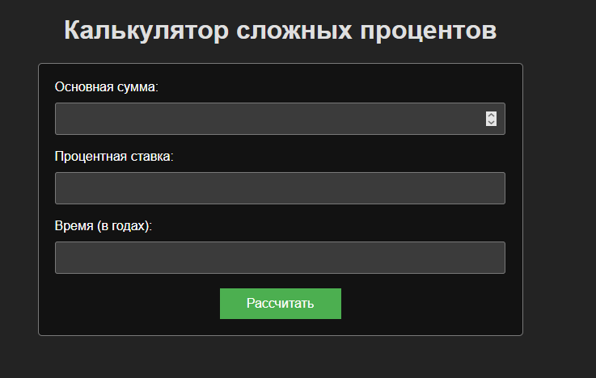
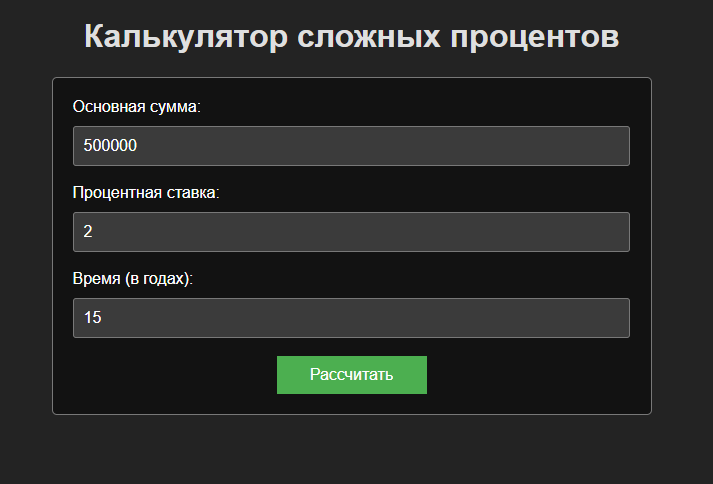
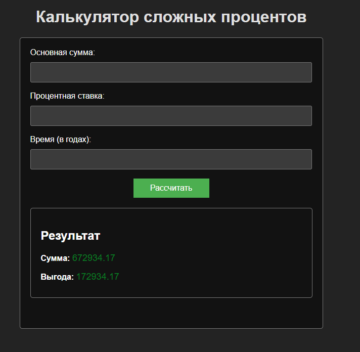

# Здесь находится 3 лаба
# Вариант 9: Калькулятор сложного процента

В файле main.py находится flask скрипт.

Директория static содержит css файл со стилями.

Директория templates содержит html файл главной страницы.

При открытии страницы отображается следующее:

### Главная страница

При вводе запрашиваемых данных и нажатии на кнопку "Рассчитать" пользователь получит результаты рассчета:

### Главная страница с заполненными полями

### Результат поиска:

