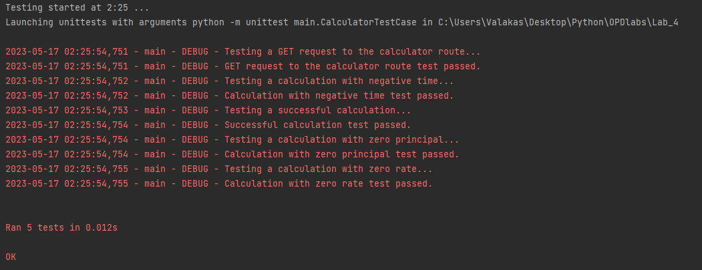

# Здесь находится 4 лаба
# Вариант 9: Калькулятор сложного процента

Файл main.py содержит unittest скрипт

В файле Flask_app.py находится flask скрипт.

Директория static содержит css файл со стилями.

Директория templates содержит html файл главной страницы.

При запуске файла main.py начинается тестирование веб приложения.

Тестируется программа при правильном вводе, нулевом стартовом вкладе, нулевом проценте,отрицательном времени.

Результат тестирования представлен на следующем скриншоте.

